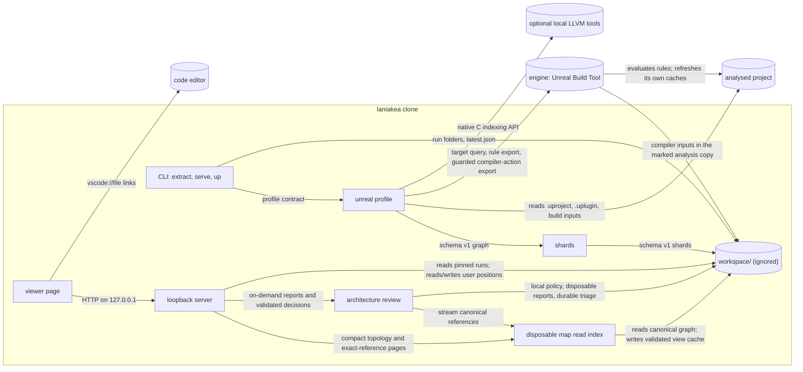

# Main view

Laniakea's parts and the externals they meet. Each arrow names the contract it goes through. Nothing inside a part is
drawn.

```mermaid
flowchart LR
    subgraph laniakea["laniakea clone"]
        CLI["CLI: extract, serve, up"] -->|"profile contract"| Profile["unreal profile"]
        CLI -->|"run folders, latest.json"| Workspace[("workspace/ (ignored)")]
        Profile -->|"schema v1 graph"| Shards["shards"]
        Shards -->|"schema v1 shards"| Workspace
        MapIndex["disposable map read index"] -->|"reads canonical graph; writes validated view cache"| Workspace
        Server -->|"compact topology and exact-reference pages"| MapIndex
        Server -->|"on-demand reports and validated decisions"| Review["architecture review"]
        Review -->|"stream canonical references"| MapIndex
        Review -->|"local policy, disposable reports, durable triage"| Workspace
        Server["loopback server"] -->|"reads pinned runs; reads/writes user positions"| Workspace
        Viewer["viewer page"] -->|"HTTP on 127.0.0.1"| Server
    end
    Profile -->|"reads .uproject, .uplugin, build inputs"| Project[("analysed project")]
    Profile -->|"target query, rule export, guarded compiler-action export"| UBT[("engine: Unreal Build Tool")]
    Profile -->|"native C indexing API"| LLVM[("optional local LLVM tools")]
    UBT -->|"evaluates rules; refreshes its own caches"| Project
    UBT -->|"compiler inputs in the marked analysis copy"| Workspace
    Viewer -->|"vscode://file links"| Editor[("code editor")]
```
