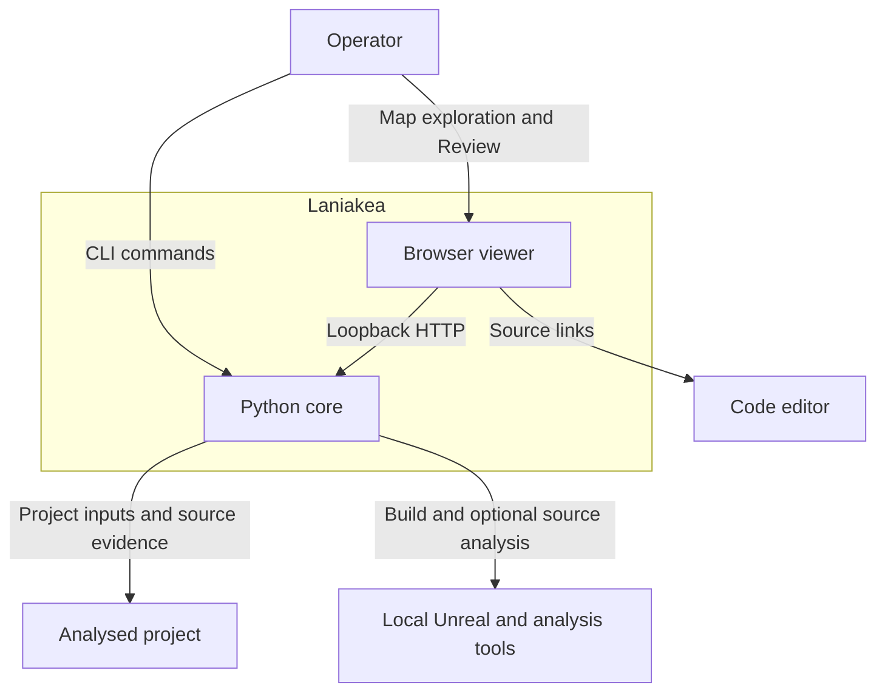

# System relationships

The local application and the people, projects and tools at its boundary.

```mermaid
flowchart TB
    Operator["Operator"]
    subgraph System["Laniakea"]
        Core["Python core"]
        Viewer["Browser viewer"]
        Viewer -->|"Loopback HTTP"| Core
    end
    Operator -->|"CLI commands"| Core
    Operator -->|"Map exploration and Review"| Viewer
    Core -->|"Project inputs and source evidence"| Project["Analysed project"]
    Core -->|"Build and optional source analysis"| Tools["Local Unreal and analysis tools"]
    Viewer -->|"Source links"| Editor["Code editor"]
```
