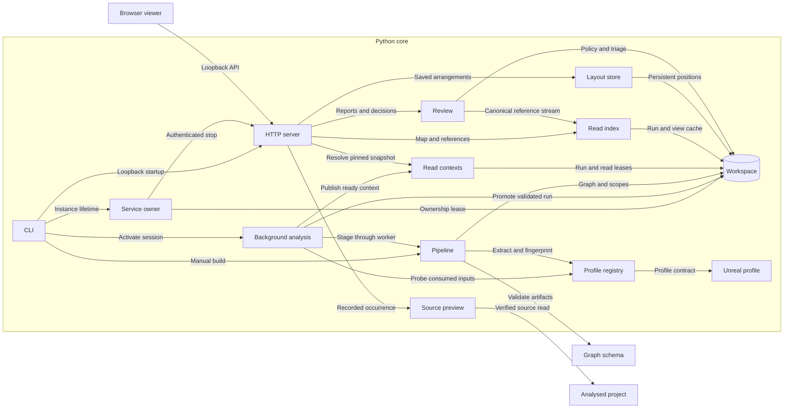

# Python core relationships

The components that acquire, publish, serve and review a graph.

```mermaid
flowchart LR
    subgraph Core["Python core"]
        CLI["CLI"] -->|"Manual build"| Pipeline["Pipeline"]
        CLI -->|"Instance lifetime"| Lifecycle["Service owner"]
        CLI -->|"Loopback startup"| Server["HTTP server"]
        CLI -->|"Activate session"| Monitor["Background analysis"]
        Lifecycle -->|"Ownership lease"| Workspace[("Workspace")]
        Lifecycle -->|"Authenticated stop"| Server
        Monitor -->|"Stage through worker"| Pipeline
        Monitor -->|"Probe consumed inputs"| Profiles["Profile registry"]
        Monitor -->|"Promote validated run"| Workspace
        Monitor -->|"Publish ready context"| Contexts["Read contexts"]
        Pipeline -->|"Extract and fingerprint"| Profiles
        Profiles -->|"Profile contract"| Unreal["Unreal profile"]
        Pipeline -->|"Graph and scopes"| Workspace
        Server -->|"Resolve pinned snapshot"| Contexts
        Contexts -->|"Run and read leases"| Workspace
        Server -->|"Map and references"| Index["Read index"]
        Index -->|"Run and view cache"| Workspace
        Server -->|"Saved arrangements"| Layouts["Layout store"]
        Layouts -->|"Persistent positions"| Workspace
        Server -->|"Reports and decisions"| Review["Review"]
        Review -->|"Canonical reference stream"| Index
        Review -->|"Policy and triage"| Workspace
        Server -->|"Recorded occurrence"| Preview["Source preview"]
    end
    Pipeline -->|"Validate artifacts"| Schema["Graph schema"]
    Viewer["Browser viewer"] -->|"Loopback API"| Server
    Preview -->|"Verified source read"| Project["Analysed project"]
```
