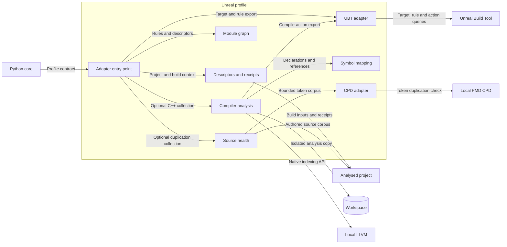

# Unreal profile relationships

The paths that turn build and optional source evidence into a graph and recorded observations.

```mermaid
flowchart LR
    subgraph Unreal["Unreal profile"]
        Profile["Adapter entry point"] -->|"Project and build context"| Inputs["Descriptors and receipts"]
        Profile -->|"Target and rule export"| Build["UBT adapter"]
        Profile -->|"Rules and descriptors"| Graph["Module graph"]
        Profile -->|"Optional C++ collection"| Native["Compiler analysis"]
        Profile -->|"Optional duplication collection"| Health["Source health"]
        Native -->|"Compile-action export"| Build
        Native -->|"Declarations and references"| Symbols["Symbol mapping"]
        Health -->|"Bounded token corpus"| CPD["CPD adapter"]
    end
    Core["Python core"] -->|"Profile contract"| Profile
    Inputs -->|"Build inputs and receipts"| Project["Analysed project"]
    Build -->|"Target, rule and action queries"| UBT["Unreal Build Tool"]
    Native -->|"Isolated analysis copy"| Workspace[("Workspace")]
    Native -->|"Native indexing API"| LLVM["Local LLVM"]
    Health -->|"Authored source corpus"| Project
    CPD -->|"Token duplication check"| PMD["Local PMD CPD"]
```
