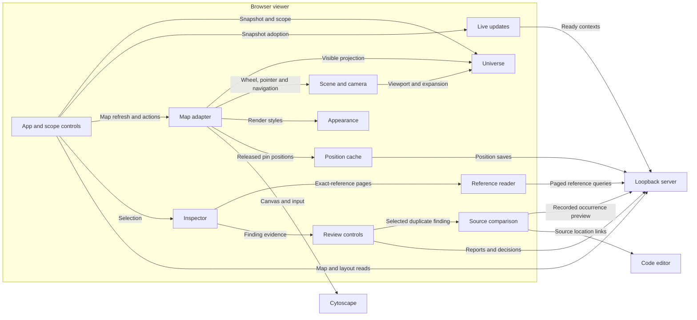

# Viewer relationships

The components that turn a recorded snapshot into an interactive map.

```mermaid
flowchart LR
    subgraph Viewer["Browser viewer"]
        App["App and scope controls"] -->|"Snapshot and scope"| Universe["Universe"]
        App -->|"Snapshot adoption"| Live["Live updates"]
        App -->|"Map refresh and actions"| Map["Map adapter"]
        App -->|"Selection"| Inspector["Inspector"]
        Map -->|"Visible projection"| Universe
        Map -->|"Wheel, pointer and navigation"| Camera["Scene and camera"]
        Camera -->|"Viewport and expansion"| Universe
        Map -->|"Render styles"| Style["Appearance"]
        Map -->|"Released pin positions"| Positions["Position cache"]
        Inspector -->|"Exact-reference pages"| References["Reference reader"]
        Inspector -->|"Finding evidence"| Review["Review controls"]
        Review -->|"Selected duplicate finding"| Source["Source comparison"]
    end
    Map -->|"Canvas and input"| Cytoscape["Cytoscape"]
    App -->|"Map and layout reads"| Server["Loopback server"]
    Live -->|"Ready contexts"| Server
    References -->|"Paged reference queries"| Server
    Positions -->|"Position saves"| Server
    Review -->|"Reports and decisions"| Server
    Source -->|"Recorded occurrence preview"| Server
    Source -->|"Source location links"| Editor["Code editor"]
```
